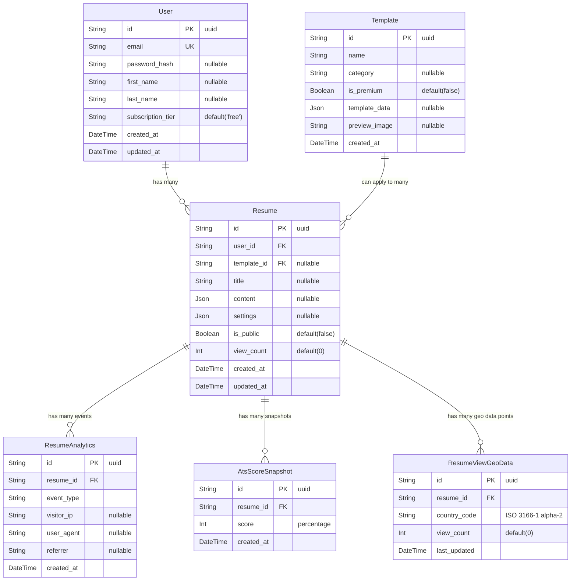

**Explanation of Relationships:**
*   A `User` can have many `Resume` records. (One-to-Many)
*   A `Template` can be applied to many `Resume` records. (One-to-Many, though a Resume has one Template)
*   A `Resume` can have many `ResumeAnalytics` event records. (One-to-Many)

This diagram reflects the schema defined in `packages/schema/prisma/schema.prisma` focusing on the tables relevant to user resumes and their analytics.
The `ats_score_snapshot` table is not included as its scope for US003 is pending clarification.
The `view_count` on the `Resume` table is noted in `schema.prisma` as potentially redundant if `ResumeAnalytics` is the source of truth for views; this ERD reflects the current schema.
